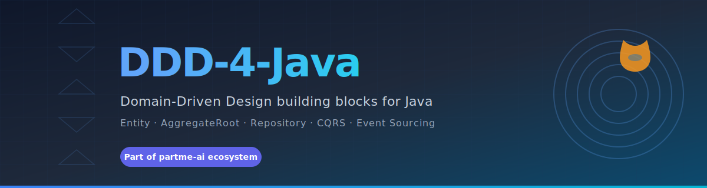

# DDD-4-Java

<p align="center">
  
</p>

<p align="center">
  <strong>面向 Java 的领域驱动设计（DDD）基础构件库 —— 让 DDD / CQRS / Event Sourcing 在 Java 生态以工程化、规范化、可复用方式落地</strong>
</p>

<p align="center">
  <a href="https://github.com/ddd-4-java"></a>
  <a href="https://github.com/ddd-4-rust"></a>
  <a href="https://github.com/partme-ai"></a>
  <a href="https://github.com/ddd-4-java/.github/blob/main/profile/LICENSE"></a>
</p>

---

## 关于我们

**DDD-4-Java** 是 partme-ai 开源生态旗下的 DDD 架构基础构件组织，专注于为 Java 生态提供**领域驱动设计（DDD）/ CQRS / 事件溯源（Event Sourcing）** 的工程化基础组件。

我们的核心理念是：

> **将 DDD 方法论沉淀为可复用的代码构件，让业务架构不再"千人千面"。**

每个构件遵循统一的命名约定、接口规范与扩展点，确保跨项目、跨团队的可移植性。

### 设计原则

- **🏛️ 架构优先** — Entity / ValueObject / AggregateRoot / Repository 等核心抽象严格对齐 DDD 蓝皮书
- **🧩 可插拔** — 持久化、消息、缓存均通过 SPI 扩展，不绑定任何特定框架
- **📐 规范一致** — 与 `ddd-4-rust` 保持接口级对等，跨语言团队可对照阅读
- **🧪 测试友好** — 内置领域事件回放、聚合根快照、命令/查询一致性校验

---

## 构件矩阵

### 核心仓库

| 仓库 | groupId | 说明 |
|------|---------|------|
| [`ddd4j`](https://github.com/ddd-4-java/ddd4j) | `io.ddd4j` | 核心 DDD 构件：Entity / Aggregate / DomainEvent / Repository / CQRS |
| [`ddd4j-boot`](https://github.com/ddd-4-java/ddd4j-boot) | `io.ddd4j.boot` | Spring Boot 集成：44+ Starter、auth/cache/data/ddd 等模块 |
| [`ddd4j-javalin`](https://github.com/ddd-4-java/ddd4j-javalin) | `io.ddd4j.javalin` | Javalin 集成：auth/cache/data/ddd 等模块 |
| [`ddd4j-quarkus`](https://github.com/ddd-4-java/ddd4j-quarkus) | `io.ddd4j.quarkus` | Quarkus 集成：auth/cache/data/ddd 等模块 |
| [`ddd4j-ai`](https://github.com/ddd-4-java/ddd4j-ai) | `io.ddd4j.ai` | AI 核心契约与组件（规划中） |

> ⚠️ 所有仓库均为 **private** —— 当前只对组织成员可见，正在积极重构中。

---

## 架构概览

```
┌─────────────────────────────────────────────────────────────┐
│                    Interfaces (REST / RPC / CLI)            │
└──────────────────────────┬──────────────────────────────────┘
                           │
┌──────────────────────────▼──────────────────────────────────┐
│                Application Layer                             │
│   Command / Query / UseCase / Saga                          │
└──────────────────────────┬──────────────────────────────────┘
                           │
┌──────────────────────────▼──────────────────────────────────┐
│                  Domain Layer                                │
│   Entity · AggregateRoot · DomainEvent · Specification       │
└──────────────────────────┬──────────────────────────────────┘
                           │
┌──────────────────────────▼──────────────────────────────────┐
│               Infrastructure Layer                           │
│   Repository · EventBus · EventStore · SnapshotStore         │
└─────────────────────────────────────────────────────────────┘
```

---

## 快速开始

> ⚠️ **当前状态**：所有仓库正在积极重构中。Maven Central 尚未发布。欢迎关注进度或参与共建。

### Maven 依赖（暂未发布到 Maven Central）

当前仓库均为 **private**，正在重构。**正式版发布前请勿依赖**。

一旦重构完成，会通过以下方式分发：

- **Maven Central**：`io.ddd4j:ddd4j-core:VERSION`
- **JitPack**：用于早期尝鲜的快照版本

跟踪进度：[Discussions](https://github.com/orgs/ddd-4-java/discussions) · [ddd4j Issues](https://github.com/ddd-4-java/ddd4j/issues)

---

## 相关生态

| 组织 | 说明 |
|------|------|
| 🏛️ [ddd-4-rust](https://github.com/ddd-4-rust) | Rust 版本，接口级对齐 |
| 🧰 [easy-4-java](https://github.com/easy-4-java) | 业务工具集（Java） |
| 🧰 [easy-4-rust](https://github.com/easy-4-rust) | 业务工具集（Rust） |
| 💾 [rbatis-plus](https://github.com/rbatis-plus) | ORM 生态（Repository 实现层） |
| 🧠 [partme-ai](https://github.com/partme-ai) | 顶层 AI 智能体生态 |

---

## 贡献指南

欢迎贡献 DDD 基础构件！

1. **Fork** 目标仓库
2. 创建特性分支
3. 遵循既有命名约定与接口规范
4. 补充单元测试与领域示例
5. 提交 **Pull Request**

> 重大设计决策请先在 [Discussions](https://github.com/orgs/ddd-4-java/discussions) 发起 RFC。

---

## 联系我们

- Email: [partmeai@gmail.com](mailto:partmeai@gmail.com)
- GitHub: [github.com/ddd-4-java](https://github.com/ddd-4-java)

---

<div align="center">

**让 DDD 在 Java 生态工程化落地**

Made with ❤️ by PartMe AI Team

</div>